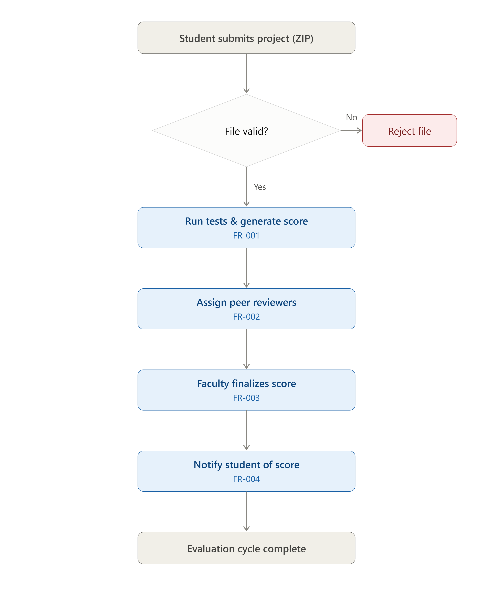

# Functional Requirements (FR) & User Stories
## Project: Automated Rubric Assignment Evaluator
**Student:** Sharat Doddihal | **SRN:** PES1UG24CS430

---

## 1. Introduction
This document outlines the **Functional Requirements** and **User Stories** for the Automated Rubric Assignment Evaluator system, strictly aligned with the Agile Sprint Planning (Lab 2).

---

## 2. Actors
| Actor | Description |
|---|---|
| **Student** | Submits project files and views final results |
| **Faculty Evaluator** | Reviews automated scores and adjusts them if necessary |
| **System (Automated)** | Validates files, runs test cases, scores submissions, assigns peers |

---

## 3. Epics and User Stories (Functional Requirements)

The functional requirements are mapped directly to the Agile backlog Epics and User Stories tracked in Jira.

### Epic 1: Submission Management
| FR ID | User Story ID | Requirement / User Story | Priority |
|---|---|---|---|
| FR-01 | **US-01** | **Submit Project:** As a Student, I want to submit my project files so that they can be evaluated. | High |
| FR-02 | **US-02** | **Validate Submission:** As the System, I want to validate the uploaded files to ensure they meet format and size constraints before processing. | High |

### Epic 2: Automated Evaluation
| FR ID | User Story ID | Requirement / User Story | Priority |
|---|---|---|---|
| FR-03 | **US-03** | **Add Submission to Evaluation Queue:** As the System, I want to queue valid submissions so that they are processed systematically without overloading the server. | High |
| FR-04 | **US-04** | **Run Test Cases:** As the System, I want to execute predefined test cases against the submitted code in a sandbox. | High |
| FR-05 | **US-05** | **Generate Rubric Score:** As the System, I want to calculate a score based on the test case results and the predefined rubric. | High |

### Epic 3: Peer Review Assignment
| FR ID | User Story ID | Requirement / User Story | Priority |
|---|---|---|---|
| FR-06 | **US-06** | **Assign Peer Reviewer:** As the System, I want to automatically assign a peer reviewer to a successful submission. | Medium |
| FR-07 | **US-07** | **Flag Failed Evaluation:** As the System, I want to flag evaluations that fail test cases or fall below a certain threshold for manual review. | High |

### Epic 4: Faculty Review & Results
| FR ID | User Story ID | Requirement / User Story | Priority |
|---|---|---|---|
| FR-08 | **US-08** | **Review Automated Score:** As a Faculty Evaluator, I want to review the system-generated rubric scores and flagged submissions. | High |
| FR-09 | **US-09** | **Adjust Final Score:** As a Faculty Evaluator, I want to adjust and finalize the student's score based on my manual review. | High |
| FR-10 | **US-10** | **View Final Result:** As a Student, I want to view my final finalized score and feedback on the dashboard. | High |

---

## 4. Activity Flow Reference
See [`fr_functional_activity_flow.png`](../fr_functional_activity_flow.png) (in root) for the complete functional activity flow diagram.

