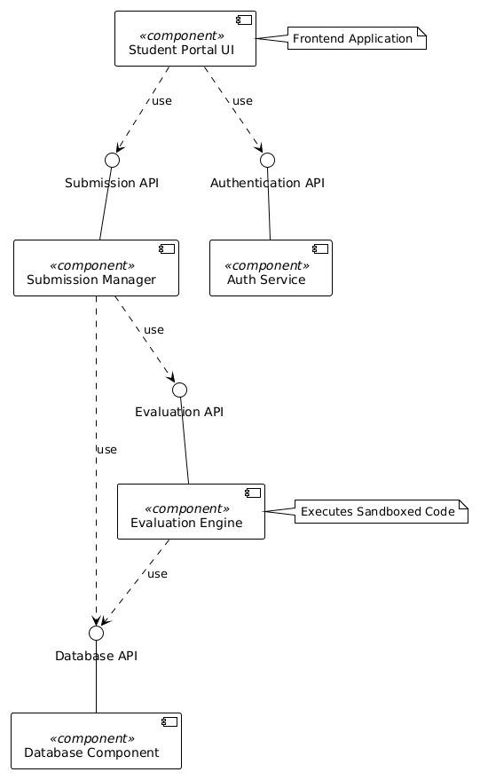

# Architectural Diagram
## Project: Automated Rubric Assignment Evaluator
**Student:** Sharat Doddihal | **SRN:** PES1UG24CS430

---

## 1. System Architecture Overview

The system follows a **3-Tier Layered Architecture** consisting of:
- **Presentation Layer** – Web-based UI (React/HTML)
- **Application/Business Logic Layer** – Backend API (Node.js / Python Flask)
- **Data Layer** – Relational database (PostgreSQL) + File Storage

---

## 2. High-Level Architecture Diagram

```
┌─────────────────────────────────────────────────────────────────┐
│                        CLIENT LAYER                             │
│  ┌──────────────────┐        ┌──────────────────────────────┐  │
│  │  Student Portal  │        │    Faculty Evaluator Portal   │  │
│  │  (Web Browser)   │        │       (Web Browser)          │  │
│  └────────┬─────────┘        └──────────────┬───────────────┘  │
└───────────│──────────────────────────────────│──────────────────┘
            │ HTTPS / REST API                 │ HTTPS / REST API
┌───────────▼──────────────────────────────────▼──────────────────┐
│                     APPLICATION LAYER                            │
│  ┌──────────────┐  ┌──────────────┐  ┌────────────────────────┐ │
│  │  Auth Module │  │  Submission  │  │   Evaluation Engine    │ │
│  │  (JWT/OAuth) │  │   Module     │  │  (Test Runner +        │ │
│  └──────────────┘  └──────────────┘  │   Rubric Scorer)       │ │
│  ┌──────────────┐  ┌──────────────┐  └────────────────────────┘ │
│  │  Notification│  │   Reviewer   │  ┌────────────────────────┐ │
│  │   Service    │  │   Assigner   │  │    Report Service      │ │
│  └──────────────┘  └──────────────┘  └────────────────────────┘ │
└──────────────────────────────┬──────────────────────────────────┘
                               │
┌──────────────────────────────▼──────────────────────────────────┐
│                        DATA LAYER                                │
│  ┌─────────────────────┐        ┌──────────────────────────┐   │
│  │  PostgreSQL Database │        │   File Storage (S3/NFS) │   │
│  │  - Users             │        │   - Submission Files    │   │
│  │  - Submissions       │        │   - Generated Reports   │   │
│  │  - Rubrics           │        └──────────────────────────┘   │
│  │  - Scores            │                                        │
│  │  - Audit Logs        │                                        │
│  └─────────────────────┘                                        │
└─────────────────────────────────────────────────────────────────┘
```

---

## 3. Component Descriptions

| Component | Technology | Responsibility |
|---|---|---|
| Student Portal | React.js / HTML5 | Submission UI, result viewing |
| Faculty Portal | React.js / HTML5 | Score review, rubric management |
| Auth Module | JWT + OAuth 2.0 | User authentication & authorization |
| Submission Module | REST API (Node.js) | Handle file uploads and validation |
| Evaluation Engine | Python / Sandbox | Execute test cases, compute rubric scores |
| Reviewer Assigner | Algorithm Module | Auto-assign peer reviewers |
| Notification Service | Email / WebSocket | Notify students and faculty |
| Report Service | PDF Generator | Generate evaluation reports |
| Database | PostgreSQL | Persistent data storage |
| File Storage | AWS S3 / NFS | Store uploaded project files |

---

## 4. Data Flow

```
Student Submits → File Validation → Stored in File Storage
                                          ↓
                           Evaluation Engine Triggered (Async)
                                          ↓
                           Test Cases Executed → Rubric Scored
                                          ↓
                           Score Flagged? → Faculty Review
                                          ↓
                           Score Finalized → Notification Sent → Student Views Result
```

---

## 5. Deployment Architecture

```
Internet
    │
    ▼
[Load Balancer]
    │
    ├──► [Web Server - Node.js] ──► [PostgreSQL DB]
    │                           └──► [File Storage]
    └──► [Evaluation Worker]   ──► [Job Queue (Redis)]
```

> **Note:** For production, containerization with Docker and orchestration via Kubernetes is recommended for scalability.

---

## 6. Files in This Folder

| File | Description |
|---|---|
| [`Architecture_Document.md`](./Architecture_Document.md) | This document — full architecture description |
| [`Lab3_Component_Diagram.png`](./Lab3_Component_Diagram.png) | UML Component Diagram (5 components, 4 interfaces, ball/socket notation) |
| [`Lab3_Architecture_Justification.md`](./Lab3_Architecture_Justification.md) | Lab 3 justification: Microservices architecture choice, 2 reasons, security & performance |
| [`Lab3_Component_Diagram_Instructions.md`](./Lab3_Component_Diagram_Instructions.md) | PlantUML source code used to generate the component diagram |

## Component Diagram Preview


