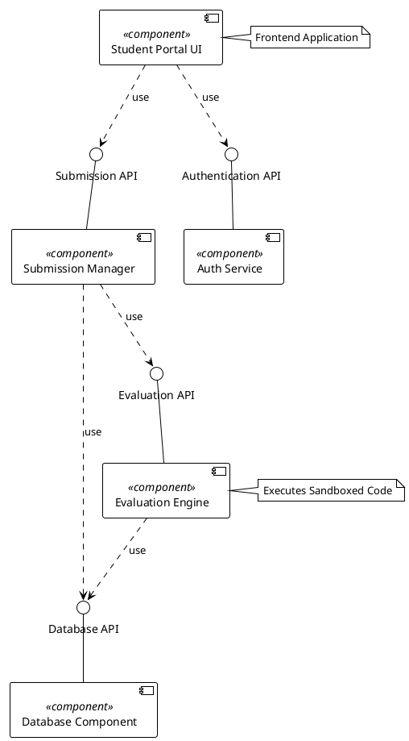

# Lab 3 Component Diagram

To fulfill the diagram requirement for Lab 3, you can easily generate the required UML Component Diagram (with ball and socket interfaces) by copying the PlantUML code below into **draw.io**.

### Instructions to generate diagram in draw.io:
1. Go to [draw.io](https://app.diagrams.net/)
2. Click **Arrange** in the top menu -> **Insert** -> **Advanced** -> **PlantUML**
3. Paste the code below and click **Insert**
4. The diagram with the 5 components and 4 interfaces (with provided/required notation) will be automatically generated.
5. You can then export it as PNG or PDF for your submission!

