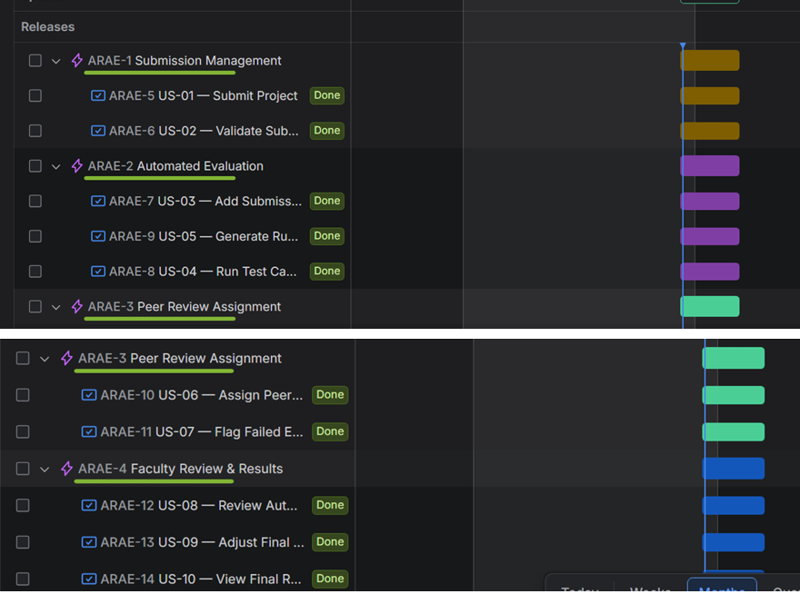
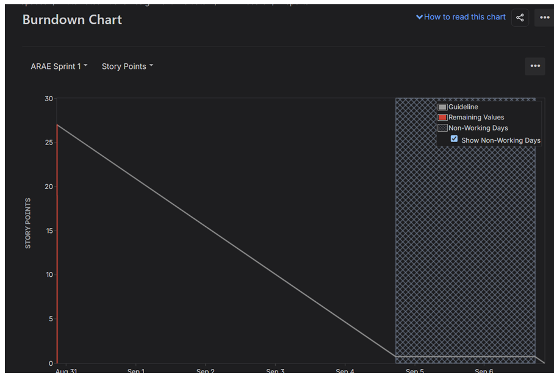
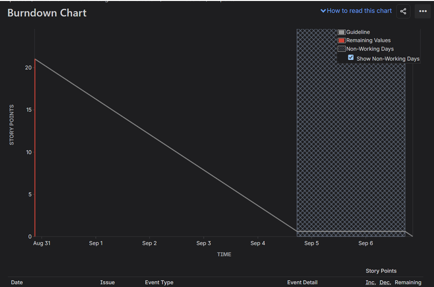

# Project Creation Screenshots
## Project: Automated Rubric Assignment Evaluator
**Student:** Sharat Doddihal | **SRN:** PES1UG24CS430

---

## Overview

This folder contains screenshots documenting the initial project creation and setup in **GitHub** and **Jira** project management tool.

### 📄 Lab 2 Report
* [`Lab2_Agile_Sprint_Report.md`](./Lab2_Agile_Sprint_Report.md) - Contains the sprint planning Q&A and Jira experience details from the Lab 2 assignment.

---

## 📸 Screenshots to Add

### GitHub Screenshots
Place the following screenshots in this folder:

| File Name | What to Capture |
|---|---|
| `github_repo_creation.png` | Screenshot of creating the GitHub repository |
| `github_repo_overview.png` | Screenshot of the repository main page |
| `github_issues.png` | Screenshot of GitHub Issues (if used for task tracking) |
| `github_project_board.png` | Screenshot of GitHub Projects board (if used) |
| `github_commits.png` | Screenshot of commit history |

### Jira Screenshots
Here are the uploaded Jira screenshots from the Lab 2 assignment:

| File Name | Description |
|---|---|
| [`jira_backlog.png`](./jira_backlog.png) | Screenshot of the product backlog showing 4 Epics and 10 User Stories |
| [`jira_burndown_chart_1.png`](./jira_burndown_chart_1.png) | First Burndown Chart screenshot |
| [`jira_burndown_chart_2.png`](./jira_burndown_chart_2.png) | Second Burndown Chart screenshot |

#### Backlog Preview:

#### Burndown Charts:

---

## How to Add Screenshots

1. Take screenshots using the tool of your choice:
   - Windows: `Win + Shift + S` (Snipping Tool) or `Print Screen`
   - Or use the Jira/GitHub "Share" or export feature
2. Save files as `.png` format
3. Name them descriptively as listed above
4. Upload them to this folder on GitHub:
   - Go to the folder in GitHub → **Add file** → **Upload files**

---

> ⚠️ **Note:** This folder will be completed manually by the student after setting up the Jira project.
