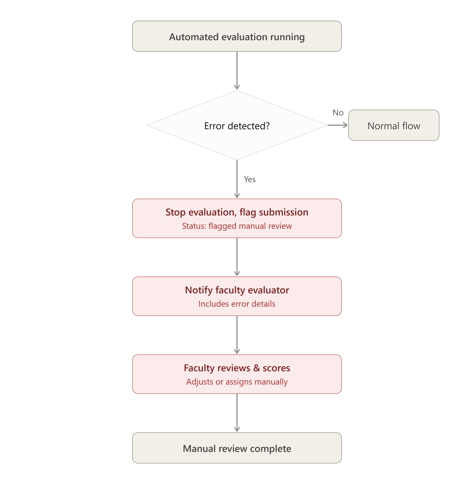

# Software Requirements Specification (SRS)
## Project: Automated Rubric Assignment Evaluator
**Student:** Sharat Doddihal | **SRN:** PES1UG24CS430  
**Date:** October 2026 | **Version:** 1.0

---

## 1. Introduction

### 1.1 Purpose
This Software Requirements Specification (SRS) defines the complete requirements for the **Automated Rubric Assignment Evaluator** — a web-based system that automates evaluation of student project submissions using predefined rubrics, test case execution, and peer review assignment.

### 1.2 Scope
The system will:
- Accept project submissions from students
- Validate uploaded files
- Automatically run test cases and assign rubric-based scores
- Allow faculty to review and adjust scores
- Notify students of final results

### 1.3 Definitions & Acronyms

| Term | Definition |
|---|---|
| FR | Functional Requirement |
| NFR | Non-Functional Requirement |
| RTM | Requirements Traceability Matrix |
| SRS | Software Requirements Specification |
| UC | Use Case |
| RBAC | Role-Based Access Control |

---

## 2. Overall Description

### 2.1 Product Perspective
The system is a standalone web application that integrates with a cloud-based file storage service and an automated code execution sandbox.

### 2.2 Product Functions
1. User authentication (Student & Faculty)
2. Project file submission and validation
3. Automated test case execution
4. Rubric-based scoring
5. Peer reviewer auto-assignment
6. Faculty score review and adjustment
7. Score finalization and student notification

### 2.3 User Classes

| User Class | Description |
|---|---|
| Student | Submits projects, views scores and feedback |
| Faculty Evaluator | Reviews AI-generated scores, manages rubrics |
| System Admin | Manages users, monitors system health |

### 2.4 Operating Environment
- Web browsers: Chrome, Firefox, Edge (latest 2 versions)
- Cloud deployment: AWS / GCP / Azure
- OS: Windows, macOS, Linux (server-side)

---

## 3. Specific Requirements

### 3.1 Functional Requirements
*(See [1-RE/Functional_Requirements.md](../1-RE/Functional_Requirements.md) for complete FR table)*

Summary:
- **FR-01 to FR-03:** Authentication and submission
- **FR-04 to FR-06:** Automated evaluation and peer assignment
- **FR-07 to FR-09:** Faculty review and score management
- **FR-10 to FR-14:** Notifications, history, rubrics, reports, dashboard

### 3.2 Non-Functional Requirements
*(See [1-RE/Non_Functional_Requirements.md](../1-RE/Non_Functional_Requirements.md) for complete NFR table)*

Summary:
- Performance: ≤ 2s response time, ≤ 5 min evaluation
- Security: JWT/OAuth, RBAC, TLS 1.2+
- Availability: 99.5% uptime
- Scalability: 10,000 users, 100 concurrent submissions

---

## 4. Use Case Specifications

### UC-03: Evaluate Submission (Primary Use Case)

**Actor:** Faculty Evaluator, System  
**Precondition:** Student has submitted a valid project file

**Main Flow:**
1. System receives submission after validation
2. System queues the submission for evaluation
3. Evaluation engine executes predefined test cases
4. System generates rubric-based score
5. Score flagged for review if below threshold
6. Faculty Evaluator reviews flagged submission
7. Faculty adjusts score (if needed)
8. System finalizes and locks the score
9. Notification sent to student

**Alternative Flow (A1) – All tests pass:**
- At step 5: Score is above threshold → auto-finalized without faculty intervention

**Exception Flow (E1) – Submission file corrupted:**
- At step 2: File validation fails → submission rejected → student notified to resubmit

*(See [`uc03_exception_flow.png`](../uc03_exception_flow.png) in root for visual exception flow diagram)*

---

## 5. Constraints

- System must be deployed on HTTPS only
- Student data must comply with institutional data privacy policies
- Code execution must happen in an isolated sandbox environment

---

## 6. Appendices

- **Appendix A:** Activity Flow Diagram → [`fr_functional_activity_flow.png`](../fr_functional_activity_flow.png)
- **Appendix B:** Exception Flow Diagram → [`uc03_exception_flow.png`](../uc03_exception_flow.png)
- **Appendix C:** RTM → [`RTM_Requirements_Traceability_Matrix.md`](../1-RE/RTM_Requirements_Traceability_Matrix.md)
- **Appendix D:** UML Component Diagram → [`Lab3_Component_Diagram.png`](../2-Architectural_Diagram/Lab3_Component_Diagram.png)
