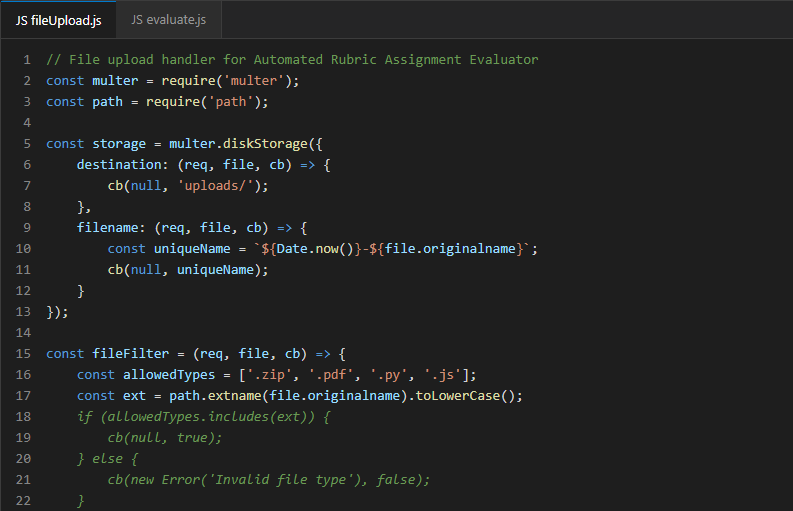

# GitHub Copilot Generated Code
## Project: Automated Rubric Assignment Evaluator
**Student:** Sharat Doddihal | **SRN:** PES1UG24CS430

---

## Overview

This folder documents the usage of **GitHub Copilot** as an AI code generation tool during the development of the Automated Rubric Assignment Evaluator project.

---

## Repository Link

The complete project code (GitHub Copilot generated + manually refined) is available at:

🔗 **[SE_individual_Sharat_Doddihal_PES1UG24CS430](https://github.com/venkamita/SE_individual_Sharat_Doddihal_PES1UG24CS430)**

---

## GitHub Copilot Usage Summary

GitHub Copilot was used to assist in generating boilerplate code, suggesting function implementations, and speeding up development across the following modules:

| Module | Copilot Used For | Notes |
|---|---|---|
| Auth Module | JWT token generation/validation boilerplate | Manually reviewed and adapted |
| Submission Module | File upload handler (multipart form) | Copilot suggested multer middleware usage |
| Evaluation Engine | Test case runner structure | Copilot suggested subprocess sandbox pattern |
| Rubric Scorer | Scoring algorithm structure | Reviewed against FR-05 requirements |
| Notification Service | Email template generation | Copilot generated nodemailer code |
| REST API Routes | CRUD route generation | Copilot suggested RESTful patterns |

---

## Sample Copilot Generated Code Snippets

### 1. File Upload Handler (Copilot Generated)
```javascript
// GitHub Copilot suggested this multer-based file upload handler
const multer = require('multer');
const path = require('path');

const storage = multer.diskStorage({
  destination: (req, file, cb) => {
    cb(null, 'uploads/');
  },
  filename: (req, file, cb) => {
    const uniqueName = `${Date.now()}-${file.originalname}`;
    cb(null, uniqueName);
  }
});

const fileFilter = (req, file, cb) => {
  const allowedTypes = ['.zip', '.pdf', '.py', '.js'];
  const ext = path.extname(file.originalname).toLowerCase();
  if (allowedTypes.includes(ext)) {
    cb(null, true);
  } else {
    cb(new Error('Invalid file type'), false);
  }
};

const upload = multer({ storage, fileFilter, limits: { fileSize: 50 * 1024 * 1024 } });
module.exports = upload;
```

### 2. JWT Authentication Middleware (Copilot Generated)
```javascript
// GitHub Copilot generated JWT verification middleware
const jwt = require('jsonwebtoken');

const authenticateToken = (req, res, next) => {
  const authHeader = req.headers['authorization'];
  const token = authHeader && authHeader.split(' ')[1];
  
  if (!token) return res.status(401).json({ error: 'Access denied' });
  
  jwt.verify(token, process.env.JWT_SECRET, (err, user) => {
    if (err) return res.status(403).json({ error: 'Invalid token' });
    req.user = user;
    next();
  });
};

module.exports = authenticateToken;
```

### 3. Rubric Scoring Function (Copilot Generated)
```python
# GitHub Copilot generated rubric scoring logic
def compute_rubric_score(test_results: dict, rubric: dict) -> dict:
    """
    Compute the final rubric-based score for a submission.
    
    Args:
        test_results: dict with test case IDs and pass/fail status
        rubric: dict with test case IDs and their maximum marks
    
    Returns:
        dict with individual scores and total score
    """
    scores = {}
    total = 0
    max_total = sum(rubric.values())
    
    for test_id, max_marks in rubric.items():
        passed = test_results.get(test_id, False)
        awarded = max_marks if passed else 0
        scores[test_id] = {"max": max_marks, "awarded": awarded}
        total += awarded
    
    return {
        "breakdown": scores,
        "total": total,
        "max_total": max_total,
        "percentage": round((total / max_total) * 100, 2)
    }
```

---

## Instructions for Adding Screenshots

## Copilot Screenshots in Action

Here is a screenshot showing GitHub Copilot providing inline suggestions while writing the file upload handler module:



---

## Tools Used

| Tool | Version | Purpose |
|---|---|---|
| GitHub Copilot | Latest | AI code generation |
| VS Code | 1.85+ | IDE with Copilot extension |
| Node.js | 18.x | Backend runtime |
| Python | 3.10+ | Evaluation engine |
